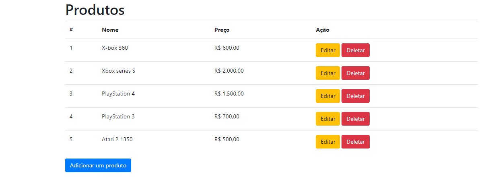
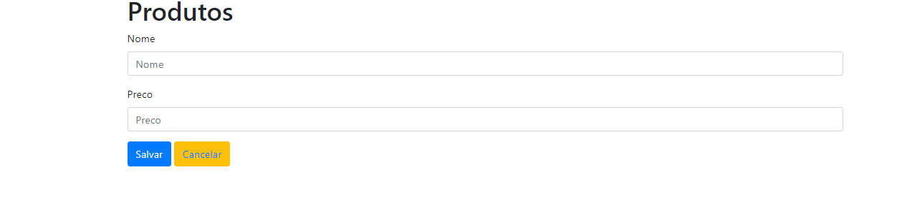
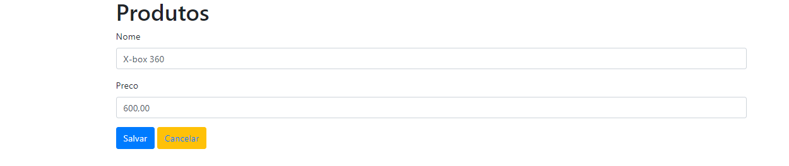

# CRUD Django.

### Teste de código.

Nesse repositório contém um projeto fullstack realizado o front-end com o BootStrap e o back-end com python e o framework
Django, (o códidigo encontra-se na branch developer).

O projeto consiste em um sistema CRUD, onde o usuário do sistema consegue realizar as operações básicas (create, read, update, delete). Criei esse projeto para entender melhor o conceito de class based views.

exemplos:

- Rota para cadastro de produtos;
- Rota para o index que é a visualização dos produtos cadastrados;
- Rota para edição de um produto;
- Rota para deletar um produto.

### Pré-requisitos

- Python devidamente instalado;
- Ambiente virtual criado e ativado:
  - windows: python -m venv venv | venv\Scripts\activate.bat;
  - linux: python -m venv/venv | source venv/bin/activate;
- O banco de dados é de sua escolha, mas nesse projeto utilizei o SQLite;
- Instalação dos requirements.txt disponibilizados;
- (Não é obrigatório para que o sistema funcione.) Criação de um superusuário para acesso da área administrativa do Django (python manage.py createsuperuser) e seguir o passo a passo;
- Rodar o comando: python manage.py makemigrations e em seguida python manage.py migrate para registro dos models no banco de dados.

### Execução do sistema

- Basta entrar no diretório do sistema e no terminal rodar o comando: python manage.py runserver
e o retorno é o http da página (index);

### Exemplo da execução

#### Rota para o index;

- Consta algumas validações, o formulário tem que estar preenchido
e com os dados certo.

#### Rota para cadastro de produto;

- Consta algumas validações, o formulário tem que estar preenchido
e com os dados certo.

#### Rota para editar o produto;

- Consta algumas validações, o formulário tem que estar preenchido
e com os dados certo.

#### Rota para o excluir o produto.

- Consta algumas validações, aparece um formulário de confirmação.

